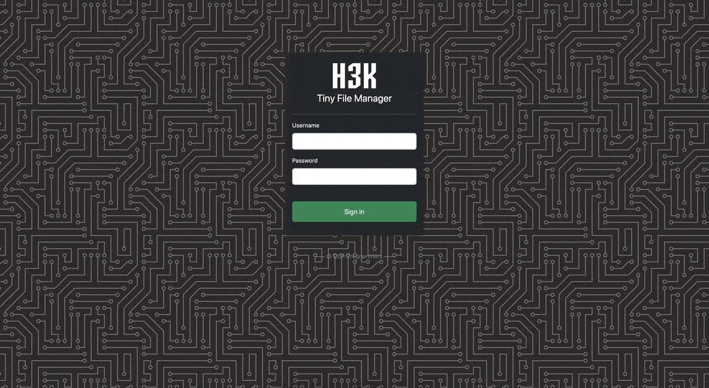

# File Manager

> FileManager is a versatile web-based PHP file manager designed for simplicity and efficiency. This lightweight single-file PHP application can be effortlessly integrated into any server directory, allowing users to store, upload, edit, and manage files and folders directly through their web browser. With multi-language support and compatibility with PHP 5.5+, FileManager enables the creation of individual user accounts, each with its dedicated directory. The platform also includes built-in functionality for handling text files using the Cloud9 IDE. Featuring syntax highlighting for over 150 languages and more than 35 themes, FileManager offers a comprehensive solution for file management in an online environment.

## Documentation

## Requirements

- PHP 5.5.0 or higher.
- Fileinfo, iconv, zip, tar and mbstring extensions are strongly recommended.

## How to use

Download ZIP with latest version from master branch.

Just copy the index.php to your webspace - thats all :)
You can also change the file name from "index.php" to something else, you know what i meant for.

Default username/password: **admin/admin@123** and **user/12345**.

To enable/disable authentication set `$use_auth` to true or false.

### :loudspeaker: Features

- :cd: **Open Source:** Lightweight, minimalist, and extremely simple to set up.
- :iphone: **Mobile Friendly:** Optimized for touch devices and mobile viewing.
- :information_source: **Core Features:** Easily create, delete, modify, view, download, copy, and move files.
- :arrow_double_up: **Advanced Upload Options:** Ajax-powered uploads with drag-and-drop support, URL imports, and multi-file uploads with extension filtering.
- :file_folder: **Folder & File Management:** Create and organize folders and files effortlessly.
- :gift: **Compression Tools:** Compress and extract files in `zip` and `tar` formats.
- :sunglasses: **User Permissions:** User-specific root folder mapping and session-based access control.
- :floppy_disk: **Direct URLs:** Easily copy direct URLs for files.
- :pencil2: **Code Editor:** Includes Cloud9 IDE with syntax highlighting for 150+ languages and 35+ themes.
- :page_facing_up: **Document Preview:** Google/Microsoft document viewer for PDF/DOC/XLS/PPT, supporting previews up to 25 MB.
- :zap: **Security Features:** Backup capabilities, IP blacklisting, and whitelisting.
- :mag_right: **Search Functionality:** Use `datatable.js` for fast file search and filtering.
- :file_folder: **Customizable Listings:** Exclude specific folders and files from directory views.
- :globe_with_meridians: **Multi-language Support:** Translations available in 35+ languages with `translation.json`.
- :bangbang: **And Much More!**

## Support & Troubleshooting

### Getting Help
- 🐛 [Open a GitHub Issue](https://github.com/BornaMashayekh/php-file-manager/issues)
- 📧 Enterprise Support: bornamashayekh@gmail.com

## License
Distributed under the MIT License. See `LICENSE` for more information.
# php-file-manager
